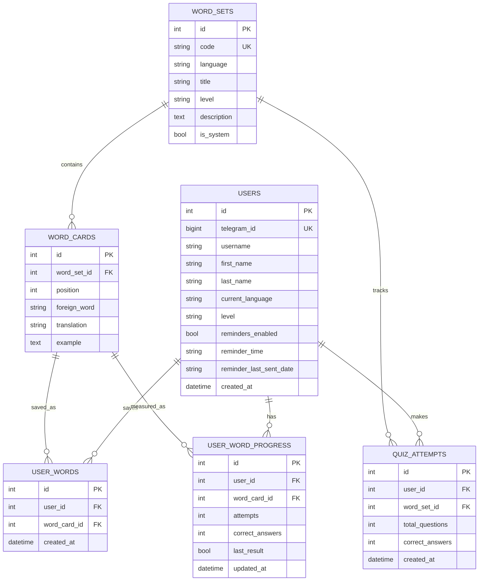

# Схема БД

База данных хранит пользователей, учебный контент, личный словарь, прогресс и настройки. Проект использует SQLAlchemy, поэтому схема может работать с PostgreSQL и SQLite.

## Таблица `users`

| Поле | Описание |
| --- | --- |
| `id` | Внутренний первичный ключ |
| `telegram_id` | Уникальный Telegram ID |
| `username` | Username пользователя |
| `first_name` | Имя пользователя |
| `last_name` | Фамилия пользователя |
| `current_language` | Текущий язык обучения: English, Spanish, Italian |
| `level` | Текущий уровень: A1, A2, B1, B2 |
| `reminders_enabled` | Включены ли напоминания |
| `reminder_time` | Время напоминания |
| `reminder_last_sent_date` | Дата последней отправки напоминания |
| `created_at` | Дата регистрации |

## Таблица `word_sets`

| Поле | Описание |
| --- | --- |
| `id` | Первичный ключ |
| `code` | Уникальный код темы |
| `language` | Язык набора слов |
| `title` | Название темы |
| `level` | Уровень темы |
| `description` | Описание темы |
| `is_system` | Признак системной учебной темы |

Системные темы показываются в разделе обучения. Служебные и пользовательские наборы скрыты из общего списка.

## Таблица `word_cards`

| Поле | Описание |
| --- | --- |
| `id` | Первичный ключ |
| `word_set_id` | Связь с темой |
| `position` | Позиция карточки внутри темы |
| `foreign_word` | Слово на изучаемом языке |
| `translation` | Перевод |
| `example` | Пример употребления |

## Таблица `user_words`

| Поле | Описание |
| --- | --- |
| `id` | Первичный ключ |
| `user_id` | Пользователь |
| `word_card_id` | Сохраненная карточка |
| `created_at` | Дата добавления |

Ограничение уникальности не позволяет сохранить одну и ту же карточку в словарь пользователя дважды.

## Таблица `user_word_progress`

| Поле | Описание |
| --- | --- |
| `id` | Первичный ключ |
| `user_id` | Пользователь |
| `word_card_id` | Карточка |
| `attempts` | Количество ответов по слову |
| `correct_answers` | Количество правильных ответов |
| `last_result` | Последний результат |
| `updated_at` | Дата обновления |

Эта таблица используется для режима повторения ошибок и рекомендаций карточек.

## Таблица `quiz_attempts`

| Поле | Описание |
| --- | --- |
| `id` | Первичный ключ |
| `user_id` | Пользователь |
| `word_set_id` | Тема или служебный тип теста |
| `total_questions` | Количество вопросов |
| `correct_answers` | Количество правильных ответов |
| `created_at` | Дата попытки |

Попытки тестов используются для экрана прогресса, цели дня, средней точности и анализа сильных/слабых тем.

## ER Diagram

