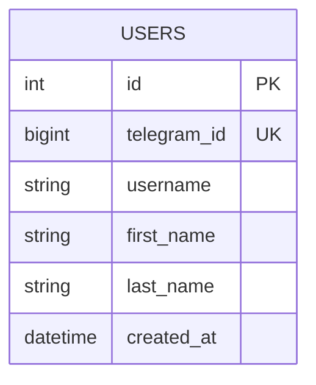

# Схема БД

На этапе спринта 2 реализована минимальная таблица пользователей.

## Таблица `users`

| Поле | Тип | Описание |
| --- | --- | --- |
| `id` | Integer | Внутренний первичный ключ |
| `telegram_id` | BigInteger | Уникальный Telegram ID пользователя |
| `username` | String(255), nullable | Username в Telegram |
| `first_name` | String(255) | Имя пользователя |
| `last_name` | String(255), nullable | Фамилия пользователя |
| `created_at` | DateTime | Дата регистрации |

## Mermaid ER Diagram

## Идея расширения

Позже к `users` можно добавить:

- `current_language`
- `level`
- `last_activity_at`

И связать таблицу с сущностями:

- `lessons`
- `words`
- `progress`

