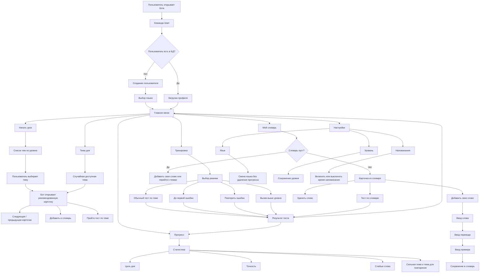

# User Flow Map

Документ описывает основные сценарии взаимодействия пользователя с Telegram-ботом для изучения иностранной лексики.

## Полная схема диалогов

## Основные сценарии

### 1. Вход и регистрация

- Пользователь вводит `/start`.
- Бот проверяет наличие пользователя в БД.
- Новый пользователь сохраняется в таблице `users`.
- Если пользователь новый, бот предлагает выбрать язык: английский, испанский или итальянский.
- После выбора языка бот открывает главное меню.
- Если пользователь уже зарегистрирован, бот сразу открывает главное меню.

### 2. Главное меню

Главное меню содержит:

- `Начать урок`
- `Тренировка`
- `Тема дня`
- `Мой словарь`
- `Прогресс`
- `Настройки`

Команда `/menu` возвращает пользователя в главное меню из любого состояния.

### 3. Начать урок

- Бот показывает доступные темы с учетом уровня.
- Темы дополнительно фильтруются по текущему языку пользователя.
- Пользователь выбирает тему.
- Бот открывает рекомендованную карточку: новую, слабую или случайную.
- Пользователь может листать карточки, сохранять слово в словарь или перейти к тесту по теме.

### 4. Тренировка

Доступны режимы:

- обычный тест по выбранной теме;
- `До первой ошибки` со случайными словами из разных доступных тем текущего языка;
- `Повторить ошибки`;
- вызов выше текущего уровня.

В тестах пользователь выбирает перевод через inline-кнопки. Бот считает правильные ответы и сохраняет результат в БД.

### 5. Мой словарь

- Пользователь видит сохраненные слова.
- Словарь отображается отдельно для текущего языка.
- Можно добавить слово вручную: слово, перевод, пример.
- Можно удалить слово из словаря.
- Можно пройти тест по словарю.
- Тест по словарю берет до 10 случайных слов за попытку.

### 6. Прогресс

Бот показывает:

- количество сохраненных слов;
- число пройденных тестов;
- цель дня;
- общее количество вопросов;
- количество правильных ответов;
- среднюю точность;
- лучший результат;
- количество слабых слов;
- сильную тему;
- тему для повторения.

Статистика считается отдельно для текущего языка. При переключении языка предыдущий прогресс сохраняется.

### 7. Настройки

Пользователь может:

- выбрать язык: английский, испанский или итальянский;
- выбрать уровень A1, A2, B1 или B2;
- включить напоминания на 09:00, 18:00 или 21:00;
- выключить напоминания.

Язык влияет на наборы слов, словарь и статистику. Уровень влияет на доступность тем. Напоминания отправляются во время работы бота.

## Команды

- `/start` — регистрация и запуск.
- `/menu` — открыть главное меню.
- `/help` — справка по возможностям.
- `/cancel` — отмена ручного добавления слова.

## Обработка нестандартных действий

Если пользователь отправляет обычный текст вне сценария добавления слова, бот предлагает пользоваться кнопками. Если пользователь нажимает устаревшую callback-кнопку, бот возвращает его в главное меню.
