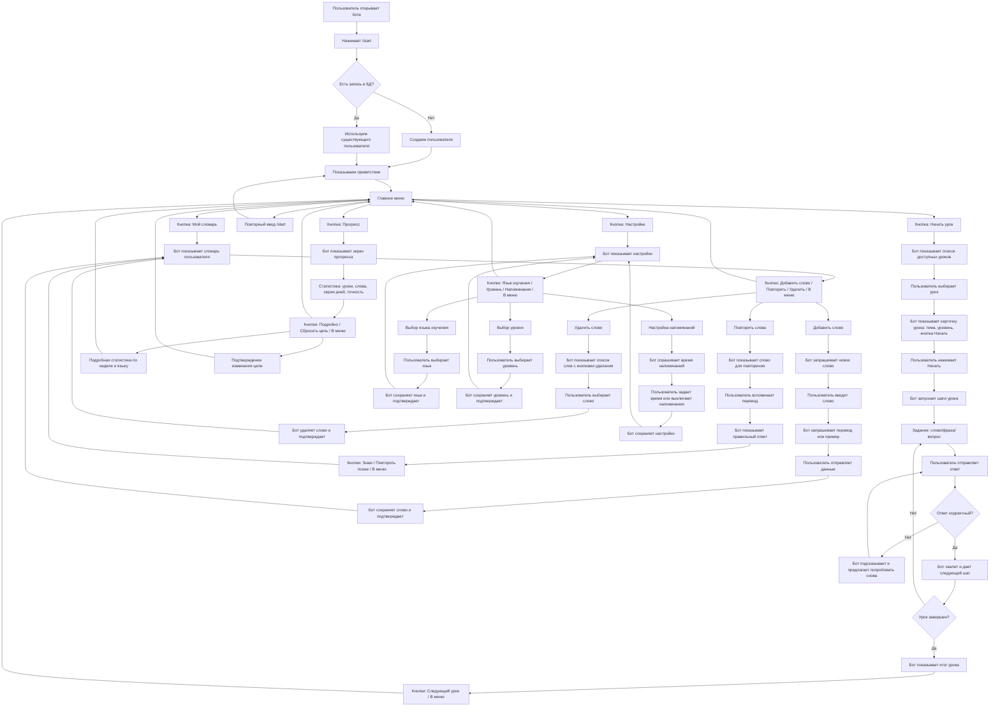

# User Flow Map

Ниже описан полный сценарий взаимодействия пользователя с ботом на уровне проектирования.
Важно: в коде спринта 2 реализовано только MVP-ядро с заглушками разделов, но схема диалогов ниже детализирует целевой пользовательский путь, который можно показывать как результат спринта 1.

## Полная схема диалогов

## Детализация сценариев по экранам

### 1. Вход и регистрация

- Пользователь открывает чат с ботом.
- Пользователь вводит `/start`.
- Бот проверяет, есть ли пользователь в БД.
- Если пользователя нет, бот создает запись.
- Бот отправляет приветствие и показывает главное меню.

### 2. Главное меню

- Экран содержит основные кнопки навигации.
- Пользователь может перейти в уроки, словарь, прогресс или настройки.
- Из любого раздела предусмотрен возврат в меню.

### 3. Раздел «Уроки»

- Бот показывает список уроков по уровню или теме.
- Пользователь выбирает урок.
- Бот показывает описание урока и кнопку запуска.
- Внутри урока бот по шагам задает вопросы.
- Пользователь отвечает сообщением или нажатием кнопки.
- Бот валидирует ответ, дает обратную связь и ведет дальше.
- После завершения бот показывает результат и предлагает следующий шаг.

### 4. Раздел «Мой словарь»

- Бот показывает список сохраненных слов.
- Пользователь может добавить новое слово.
- Пользователь может перейти в режим повторения.
- Пользователь может удалить слово из словаря.
- После каждого действия бот возвращает обновленный экран словаря.

### 5. Раздел «Прогресс»

- Бот показывает краткую статистику обучения.
- Пользователь может открыть подробную статистику.
- Пользователь может вернуться в меню.
- В будущем здесь же можно добавить цели, streak и графики.

### 6. Раздел «Настройки»

- Пользователь выбирает язык изучения.
- Пользователь выбирает уровень сложности.
- Пользователь настраивает напоминания.
- После сохранения бот возвращает пользователя в экран настроек.

## Карта кнопок для проектирования

- `/start`
  Бот регистрирует пользователя и открывает главное меню.
- `Начать урок`
  Переход в раздел уроков и список доступных тем.
- `Мой словарь`
  Переход в словарь пользователя с действиями над словами.
- `Прогресс`
  Переход в раздел статистики и прогресса.
- `Настройки`
  Переход в пользовательские настройки.
- `Назад в меню`
  Возврат в главное меню.

## Что реализовано в коде сейчас

- `/start`
- регистрация пользователя в БД
- главное меню
- переходы по разделам
- текстовые заглушки экранов

## Что пока существует только как схема

- полный сценарий прохождения урока
- добавление и повторение слов
- детальный экран прогресса
- настройка языка, уровня и напоминаний
